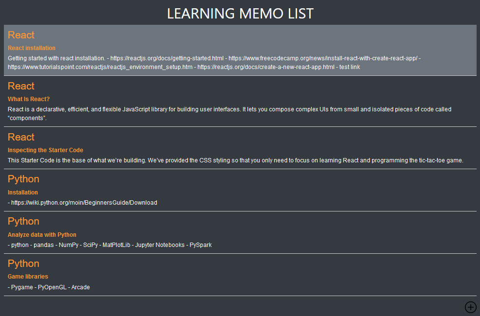
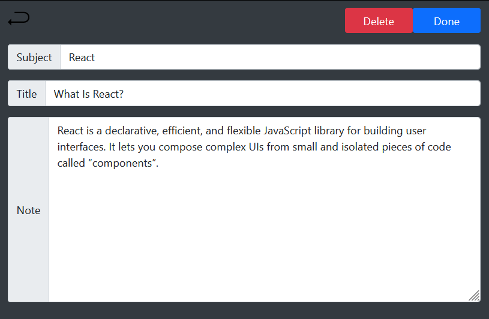

# LearningMemo

Need to remember something for later while learning a new subject? Learning Memo is the simple way to quickly save something and keep your learning journey efficiently and effectively.You can create memo, categorize memo, write down your ideas, save them or delete them.

#

### Skills used in the website

1. Django Rest Framework

2. ReactJS

3. Unit Test

#

### App Preview

<table width="100%"> 
<tr>
<td width="50%">      
&nbsp; 
 

  Memo List

</td> 
<td width="50%">
 

  Memo Update

  
</td>
</table>